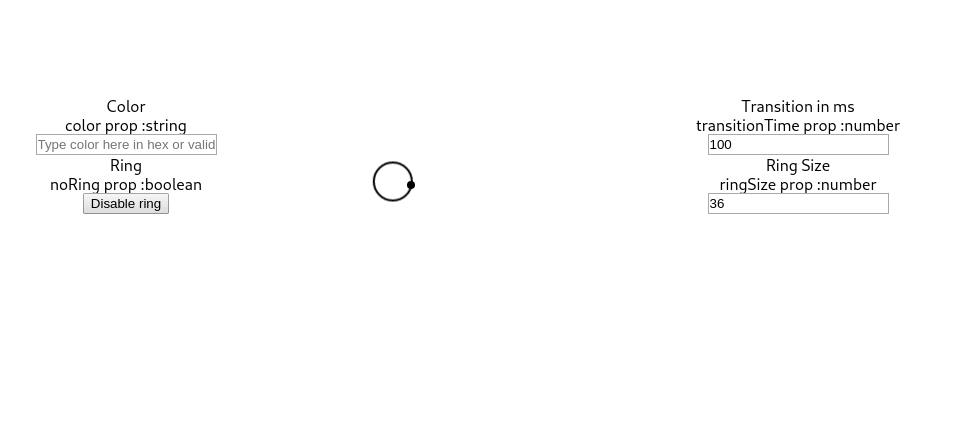

# react-cursor

> React custom cursor component

[](https://www.npmjs.com/package/react-cursor-custom) [](https://standardjs.com)
## [Live Example](https://timmilesdw.github.io/react-cursor-custom/)

## Example 



## Installation

```bash
npm install --save react-cursor
```
or

```bash
yarn add react-cursor
```

## Usage
import CursorProvider from 'react-cursor-custom' and wrap your main component with it.
```jsx
import React from 'react'

import { CursorProvider } from 'react-cursor-custom'

const App = () => {
  return (
    <CursorProvider>
      <YourMainComponent/>
    <CursorProvider/>
  )
}
```

## API

| Prop name  | Description |
| ------------- | ------------- |
| color         | [string] color of ring and dot default is black  |
| noRing         | [boolean] hide the outside ring  |
| ringSize         | [number] size of the ring  |
| transitionTime         | [number] transition time in ms  |

## License

MIT © [timmilesdw](https://github.com/timmilesdw)
